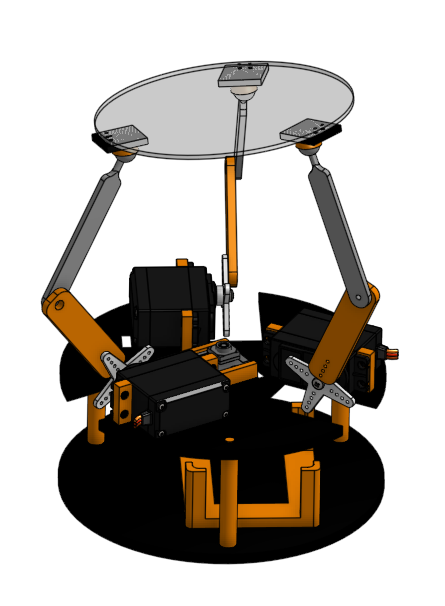

# Ball Balance PI

The project integrates computer vision, PID control, and inverse kinematics to balance a ball on a transparent platform. A Picamera2 mounted beneath the platform continuously tracks the ball's position. The error between the ball's current position and the desired center is fed into a PID controller that computes the necessary corrections. These corrections are then mapped—via linear relations and inverse kinematics—to servo motor angles that adjust the platform's tilt.



---

## Getting Started

### Prerequisites

1. **Start the pigpio daemon:**  

    The system uses `pigpiod` to control the servomotors. Start it with:
    ```bash
    sudo pigpiod
    ```

    Ensure all required Python packages are installed (e.g., via a requirements.txt file):
    ```bash
    pip install -r requirements.txt
    ```

    Run with:

    ```bash
    python3 main.py
    ```

### Project Structure

- main.py: Initializes the system and starts control threads.
- camera.py: Manages image capture and ball detection.
- pid.py: Implements the enhanced PID controller with anti-windup and derivative filtering.
- servo.py: Controls the servomotors.
- balancer.py: Contains the balancing loop that integrates the camera feedback, PID control, and inverse kinematics.

- hw: Contain the hardware design files necessary for 3D printing and assembly.

## Authors

- Matteo Jacopo Schembri  
- Davide Pantò  

**UNICT RoSys - Robotic System Group**

## Supervisors

- Dario Guastella  
- Lucia Valentina Gambuzza  
- Giuseppe Sutera


---


